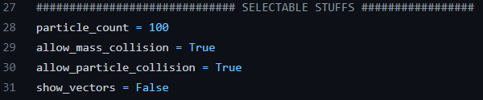
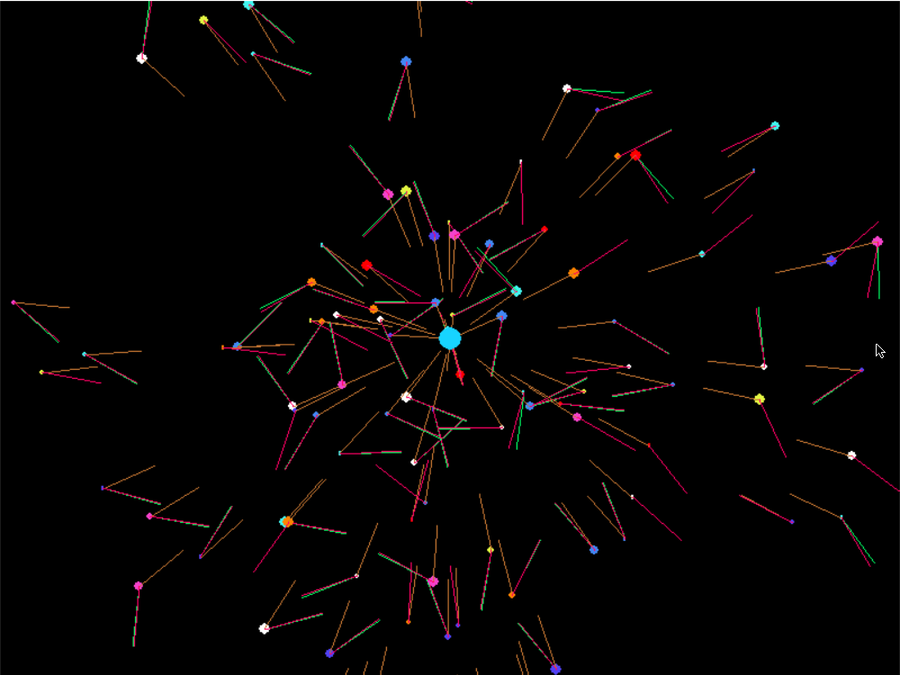

# Python Particle Simulator Thingy

This is an attempt to simulate the motion of particles (Or planets if you will) in a 2D environment. 

In the demo there is a central "mass" that is circled by n number of particles. These particles are all attracted to the central mass as planets would be attracted to the sun. Since I couldn't figure out how to get the astrophysics math to work right, the particles follow a basic set of rules that in the end somewhat mimics a real orbital system. 

If selected, there are several lines (Vectors) that are drawn off the particles. They are: 

* The force of gravity pulling toward the central mass.
* The force of inertia currently acting on the particle.
* The resultant vector from the other two forces. The resultant vector shows the projected movement of the particle. 

This project is inefficient, particularly when too many particles are being drawn. 
There are options to allow mass and particle collisions; if this is set to "False" collisions are not allowed and the particles will be removed upon impact with another particle or the central mass. (A red circle "BOOOM" indicates this) 

Pygame is required

# Screenshots

Users can select if vectors are displayed (show_vectors) or to allow collisions by changing the boolean in the code like a neanderthal

----------------------------------------------------------------

Sauron occurred accidentally in previous versions of the main program, so I decided to keep him. All hail the all-seeing Sauron.